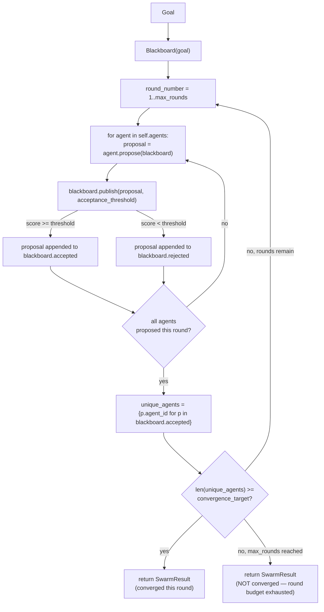
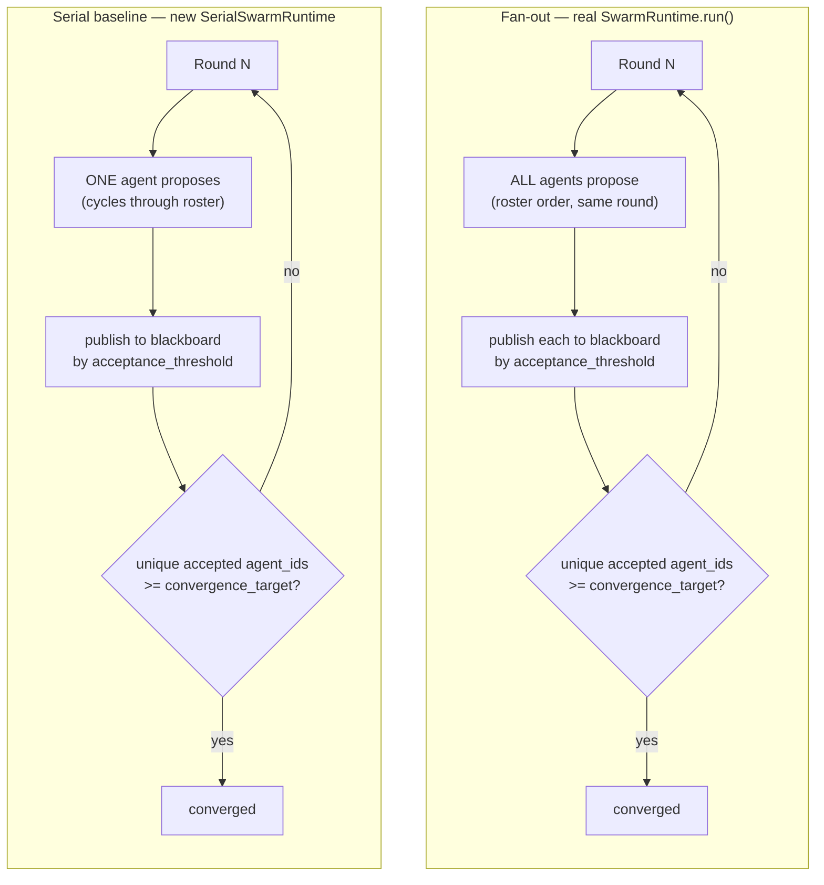

# Architecture Decision Record: Swarm Agent Pattern

## Context

Swarm architectures are useful when a system needs adaptive coordination rather than a fixed central plan. This appears in real-time operations, simulations, open-ended optimization, autonomous monitoring, and environments where useful work can emerge from many agents proposing, scoring, and reacting to shared state.

Swarm systems are powerful but risky. They should not be the default enterprise pattern. They require stronger observability, budgets, convergence rules, and safety boundaries than centralized orchestration.

## Decision

This repo implements a decentralized swarm with:

1. `SwarmAgent` instances that independently publish proposals.
2. `Blackboard` shared state that accepts or rejects proposals.
3. Peer-style proposal scoring represented as a score on each proposal.
4. `SwarmRuntime` that advances rounds and stops on convergence.

The runtime manages mechanical safety boundaries such as maximum rounds. It does not prescribe a central task plan. That distinction matters: in a swarm, agents adapt to the board and each other rather than executing a fixed sequence from an orchestrator.

## When To Use

Use this pattern for dynamic autonomous coordination:

- Real-time operations.
- Adaptive simulation.
- Incident exploration.
- Complex optimization.
- Open-ended problem solving.
- Multi-agent environments where no single coordinator has complete context.

Avoid it for regulated linear workflows, simple tool use, or tasks requiring deterministic approval chains.

## Runtime Flow

```text
Goal
  -> agents inspect blackboard
  -> agents publish proposals
  -> proposals are accepted or rejected
  -> agents adapt next round based on shared state
  -> runtime stops at convergence or round budget
```

The diagram below is the same flow drawn from the actual code in
`src/swarm_agent_pattern/swarm.py` (`SwarmRuntime.run()`): every round is a
full **fan-out** — every agent in the roster proposes, in roster order,
before the round's convergence check runs even once.



Two things worth being explicit about, since the diagram makes them visible
where the prose could gloss over them:

- Convergence is checked by **unique accepted `agent_id`s**, not proposal
  count — an agent that gets two proposals accepted in the same round only
  counts once toward `convergence_target`.
- Every round runs the **entire roster**, in the fixed order `self.agents`
  was constructed with, before the convergence check runs — there is no
  early-exit mid-round even if convergence would already be reached by an
  earlier agent's proposal that round.

## Fan-out vs. Serial Baseline (Benchmark)

`scripts/benchmark_fanout_vs_serial.py` runs 9 real scenarios against the
actual `SwarmRuntime` above, plus a new `SerialSwarmRuntime` baseline (same
script) that proposes with **one** agent per round, cycling through the
roster, instead of the full fan-out every round. Full receipt:
[`docs/receipts/benchmark.md`](receipts/benchmark.md).



**Real headline numbers, 9 scenarios, matched round budget (`max_rounds`
equal for both conditions):** fan-out converges on **7/9 (78%)** of
scenarios at a mean **1.14 rounds**; serial under the same round budget
converges on **4/9 (44%)** at a mean **3.00 rounds** — the 2 scenarios
neither condition can converge on are deliberately unreachable by design
(too small a roster, or an acceptance threshold no stub agent's score can
clear) and are reported as real non-convergence for both, not hidden.

**Read this honestly, per the repo's own receipt: fan-out's advantage here
is coverage-per-round, not invocation-efficiency.** Fan-out used **more**
total agent invocations to converge on average — **4.86** — than serial's
**3.00–4.00** (matched vs. extended budget). Fan-out wins because every
round gives it up to N chances to hit `convergence_target`, so it typically
converges in fewer *rounds*; serial only gets one proposal per round, so it
needs proportionally more rounds even though each round costs less. Given an
**extended** round budget (the same total invocation count fan-out's worst
case would spend), serial eventually reaches the same convergence_target on
every scenario fan-out does (also 7/9) — confirming serial agents are not
structurally incapable of the same answer, only slower to reach it
round-for-round under a tight round cap.

This benchmark measures the pattern's real mechanical behavior — invocation
counts and round counts from `SwarmRuntime` and `SerialSwarmRuntime`'s
actual `.run()` calls — not LLM output quality; `ExplorationAgent`,
`RiskAgent`, and `SynthesisAgent` remain deterministic stubs with no
external API calls, same as the rest of this repo.

## State Model

The blackboard is the primary coordination primitive. Production blackboards should include:

- Goal and operating constraints.
- Accepted and rejected proposals.
- Proposal lineage.
- Agent identity and permissions.
- Evidence, citations, and tool results.
- Environment observations.
- Safety policy decisions.

Use append-only event storage for audit. Agents can subscribe to board updates through pub/sub or consume snapshots at round boundaries.

## Guardrails

- Maximum round budget.
- Proposal acceptance threshold.
- Convergence target.
- Explicit accepted and rejected proposal stores.

Recommended production additions:

- Agent admission control.
- Rate limits per agent.
- Safety monitor agents with veto power.
- Environment sandboxing.
- Cost budget shared across the swarm.
- Drift detection when proposals stop improving.
- Human interruption controls.

## Failure Modes

- Emergent instability: agents amplify weak or unsafe ideas. Mitigation: safety monitors, acceptance thresholds, and veto policies.
- Non-convergence: agents continue proposing without useful progress. Mitigation: round budgets and improvement thresholds.
- Coordination opacity: behavior is hard to explain. Mitigation: event-sourced blackboard and proposal lineage.
- Cost runaway: many agents multiply calls. Mitigation: swarm-level budgets and adaptive throttling.
- Adversarial agents: one compromised agent pollutes shared state. Mitigation: identity, permissions, reputation, and quarantine.

## Scaling Strategy

Start with round-based synchronous coordination. Move to asynchronous pub/sub only when the environment requires real-time behavior. Use partitions for large swarms: local boards for subproblems and a higher-level board for cross-swarm synthesis.

## Success Metrics

- Convergence rate.
- Proposal acceptance ratio.
- Unique useful contributors.
- Improvement per round.
- Cost per consensus.
- Safety veto frequency.
- Human override rate.

